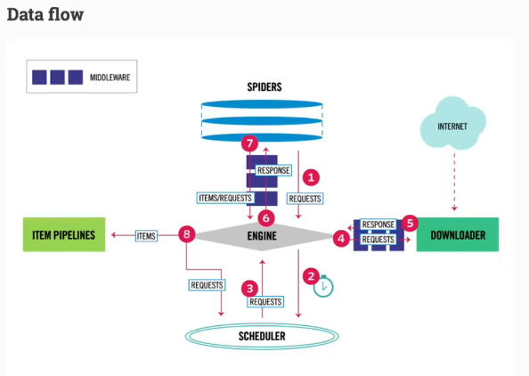

# bilibili Scrapy 观看笔记
## 优点
1. 异步请求 - 发送完请求后无需等待完成，可以先做别的事eg.抓取某数据项/存储数据库......
2. 自带架构 - 分成不同小模块，每个模块完成不同功能
## 工作流

1. spiders负责爬数据 - engine大哥，我好闲，我请求去爬网站！
2. engine(大哥大) - 带着spiders的请求来问scheduler（任务分配员）
3. scheduler - 告诉engine它能爬的具体网站
4. engine大哥 - 收到scheduler的建议，把网站爬取的请求发给downloader（html请求者）
5. downloader - 向网站发出请求获得html并把它交给engine大哥
6. engine大哥 - 拿到html并对其进行解析，筛选出有用的资料，变成item，最后把item送到pipelines
7. item piplines(数据处理者) - 把数据存入数据库/打印出来/写到文件中

1. engine
2. spider - 处理html，提取有用数据
3. downloader - 爬取网页的html（粗爬）
4. scheduler - 任务调度员
5. item pipline - 抓取的数据做最后处理

6. 有两个中间件
- process_response() - Downloader Middlewares (下载器中间件)：常见用途： 更换User-Agent、设置代理IP、自动重试、处理Cookie等。
- process_spider_input() - Spider Middlewares (蜘蛛中间件)：对Spider输出的Items进行初步过滤或修改。
1. Engine 从 Spider 获取初始的 Requests。 
2. Engine 将 Requests 发送给 Scheduler 进行调度。 
3. Scheduler 将下一个要抓取的 Request 返回给 Engine。 
4. Engine 将 Request 通过 Downloader Middlewares 发送给 Downloader。 
5. Downloader 下载内容，生成一个 Response，并通过 Middlewares 发回给 Engine。 
6. Engine 接收 Response，并通过 Spider Middlewares 发送给 Spider 进行处理。 
7. Spider 解析 Response，返回爬取到的 Items 和新的 Requests 给 Engine。 
8. Engine 将处理好的 Items 发送给 Item Pipeline，将新的 Requests 发送给 Scheduler。
从第2步重复，直到 Scheduler 中没有更多的 Requests，Engine 关闭该爬虫。
## 命令
```powershell
# 创建一个新项目
scrapy startproject <project_name>
# 2. (从Spider开始) 创建一个spider.py，然后在内写code
# 3. 启动爬虫项目，名字是spider.py里定义的name
scrapy crawl <name>

# 把处理后的数据保存到本当
scrapy crawl <name> -o result.json
```
## 保存到数据库
配置piplines.py - 操作逻辑
settings.py - 保存key、密码、端口、之类的
启动还是用scrapy crawl sina

# 大任务中继（任务中断后下次可以继续）
```powershell
# 下次只会在断开的地方继续爬
scrapy crawl sina -s JOBDIR=job
```

## Reference
bilibili视频
https://www.bilibili.com/video/BV1KHNizkEED/?spm_id_from=333.337.search-card.all.click&vd_source=2df212e4a9a7b64e26dfa0b5619b848c